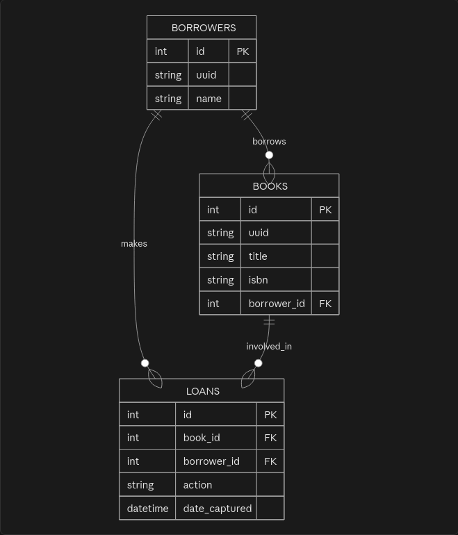

# New Feature Design

## Problem

Design a loan book solution.

Businesss requirements:
- avoid borrow a book to more than one borrowers at the same time
- keep historical data - what, when by whom (nice to have)

## Solution / Technical Specs

### Database migration 

Introduce a new entity `borrowers` (`id`, `uuid`, `name`) to store borrowers information.

Modify `books` entity to add a new column `borrower_id` referencing table `borrowers`.
The new column will determine if a book is actively borrowed and can be null. 
If it is null the book will be available for a borrower to request it. 
If the column is not null and have a reference the loan request will be declined.

Introduce a new pivot table `loans` (`id`, `book_id`, `borrower_id`, `action`, `date_captured`). 
This table will be used for historical tracking. 
The columns `book_id`, `borrower_id` are referencing the related entities.
The column `action` would be an enum with discrete values i.e. [`borrowed`, `returned`].
The `date_captured` will be filled automatically with current timestamp. 

A depiction of the DB schema 



Below is a Mermaid ERD diagram of the proposed schema

```
erDiagram
    BORROWERS ||--o{ BOOKS : borrows
    BORROWERS ||--o{ LOANS : makes
    BOOKS ||--o{ LOANS : involved_in

    BOOKS {
        int id PK
        string uuid
        string title
        string isbn
        int borrower_id FK
    }

    BORROWERS {
        int id PK
        string uuid
        string name
    }

    LOANS {
        int id PK
        int book_id FK
        int borrower_id FK
        string action
        datetime date_captured
    }
```

### Introduce a cache layer

Introduce a cache layer in order to

- store a idempotency key with a specified TTL. 
  The idempotency key will be created by a combination of the information
  `book_uuid` param + `idempotency_key` + hash(`borrower_name`)
- cache heavy queries i.e.e BookController search book action (nice to have!)

### Borrow book transaction

The business transaction will perform the actions below:

- begins a DB transaction
- Perform a select for update on `books` table related record searched by `uuid`
- If cache hit with provided idempotency key then abort and rollback
- Insert new `borrower` record
- update related `book` record's column `borrower_id`
- insert record on `loans` table with action = `borrowed`
- commit transaction
- in any other case rollback transaction
