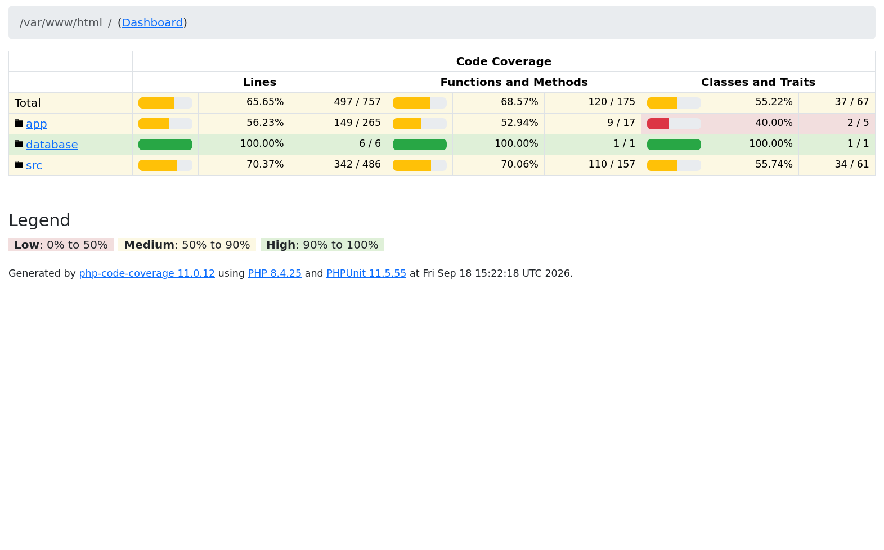

# Final Report

## Missing / Should be done / etc

- more unit tests testing code branches i.e. if's etc. 
- more unit tests testing edge cases i.e. exceptions are not swalloed etc 
- more unit tests on mapper classes (ViewModels, etc..)
- more integration tests testing more happy paths
- some more feature tests testing more HTTP response statuses
- remove coupling on Laravel's Log facade - use an explicit concrete compatible PSR implementation (i.e. Monolog)
- List books ViewModel is ugly while testing on runtime the model data type - fix BookRepository search method contract and define a solid class 
- add more HTTP requests documentation on Readme 
- add quality tools for code formating / static analysis 

## Test Coverage

**Thank you for your time**

